# 🥘 Platr – Your Personal Recipe Companion
Platr is a beautifully designed Flutter-based recipe application that helps users explore, create, and manage a wide variety of recipes. Whether you're a seasoned chef or a home cook, Platr makes cooking and meal planning easier, more fun, and more personalized.


## 📱 Download APK

[](https://github.com/Mim1726/Android-Project-DU-CodeBots/releases/download/v1.0.0/app-release.apk)


---

## 📱 Features

### 1. 🍽️ Explore Recipes
- Browse a collection of recipes categorized by cuisines (e.g., Indian, Italian, Chinese, etc.)
- View detailed ingredients and cooking instructions
- See nutrition facts and cooking time

### 2. 📝 Upload Personal Recipes
- Add your own recipes with title, description, ingredients, instructions, and images
- Save as draft or submit for review

### 3. 🔖 Bookmark & Offline Access
- Bookmark your favorite recipes
- View them even without an internet connection

### 4. ❤️ Interact with Recipes
- Like, comment, and share your favorite recipes
- Messenger-style interaction icons with animated effects

### 5. 📊 Spice Calculator
- Calculate ingredient proportions based on your input
- Choose units (grams, tsp, tbsp, etc.)
- Save or share your calculated output

### 6. 📧 About Us Page
- Meet the developers behind Platr
- Click on email addresses to contact via your default mail app

### 7. 🔐 Authentication
- Sign up and log in with Firebase Authentication
- Secure and user-friendly authentication system

---

## 🚀 Getting Started

### Prerequisites
- Flutter SDK installed
- Firebase project setup
- Android Studio or VS Code

### Installation
```bash
# Install Flutter SDK
flutter --version

# Clone the project's repository
git clone git clone https://github.com/Mim1726/Android-Project-DU-CodeBots.git

# Navigate to project's directory
cd Android-Project-DU-CodeBots

# Get dependencies
flutter pub get

```
### Launch Application
```
flutter run
```
---

## 🔧 Tech Stack

- **Flutter** – Frontend UI
- **Firebase Firestore** – Real-time database
- **Firebase Auth** – User authentication
- **Firebase Storage** – Image hosting
- **Dart** – Main programming language

---

## 📸 Screenshots

<table> <tr> <td align="center"> 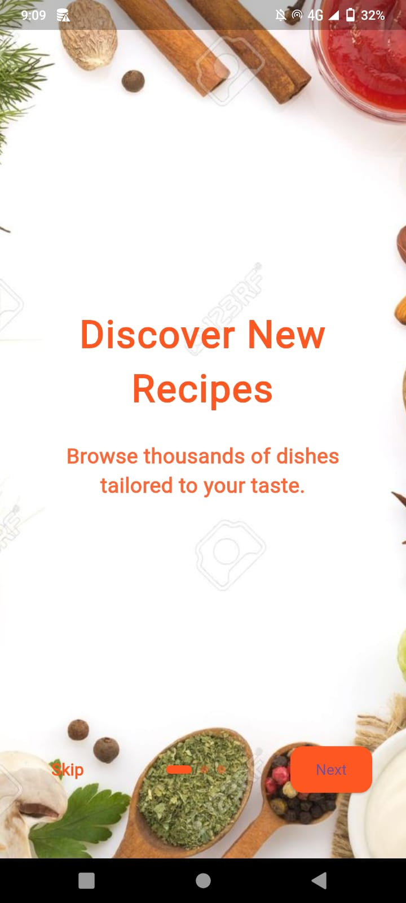<br/> <sub><b>Onboarding 1</b></sub> </td> <td align="center"> 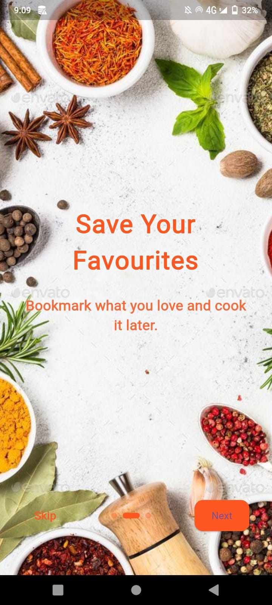<br/> <sub><b>Onboarding 2</b></sub> </td> <td align="center"> 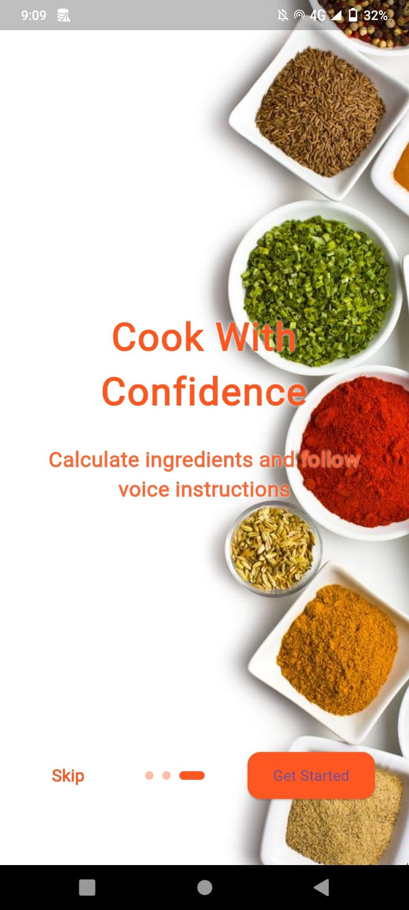<br/> <sub><b>Onboarding 3</b></sub> </td> </tr> <tr> <td align="center"> 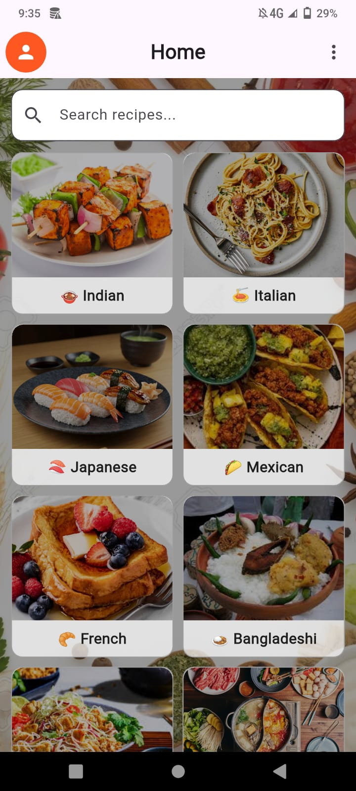<br/> <sub><b>Home Screen</b></sub> </td> <td align="center"> 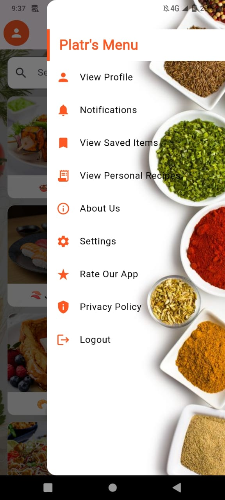<br/> <sub><b>Side Navigation</b></sub> </td> <td align="center"> 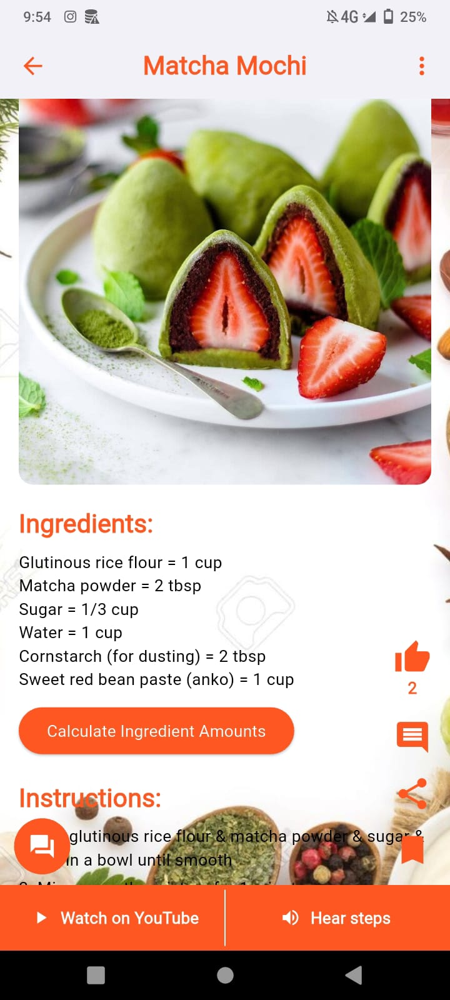<br/> <sub><b>Recipe Details</b></sub> </td> </tr> <tr> <td align="center"> 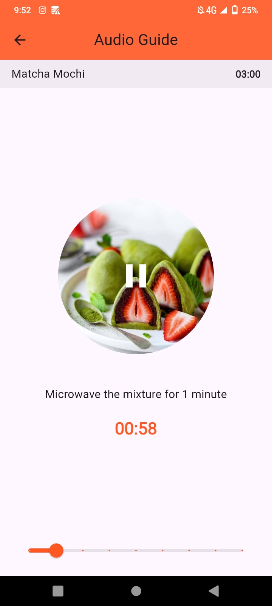<br/> <sub><b>Voice Feature</b></sub> </td> <td align="center"> 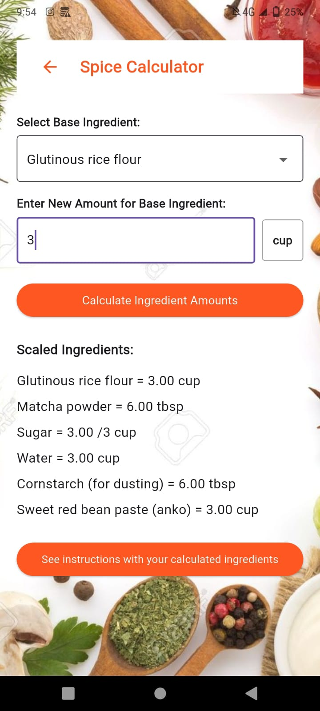<br/> <sub><b>Spice Calculator</b></sub> </td> <td align="center"> 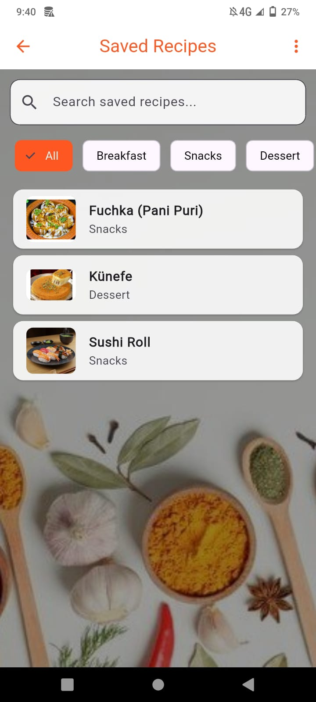<br/> <sub><b>Saved Items</b></sub> </td> </tr> <tr> <td align="center"> 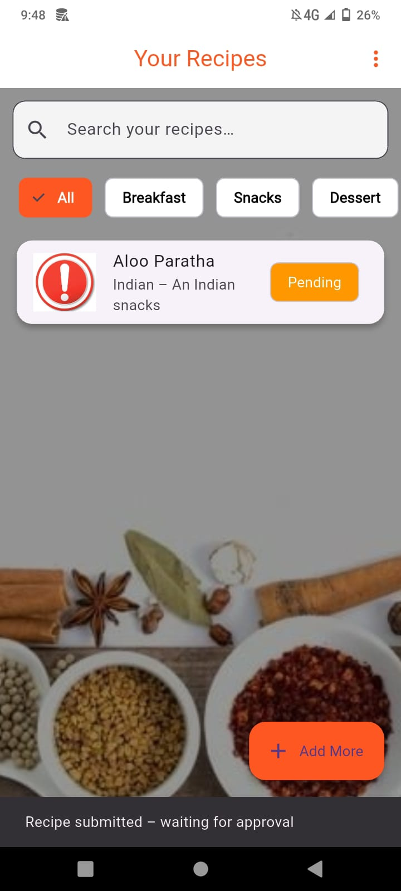<br/> <sub><b>Personal Recipes</b></sub> </td> <td align="center"> 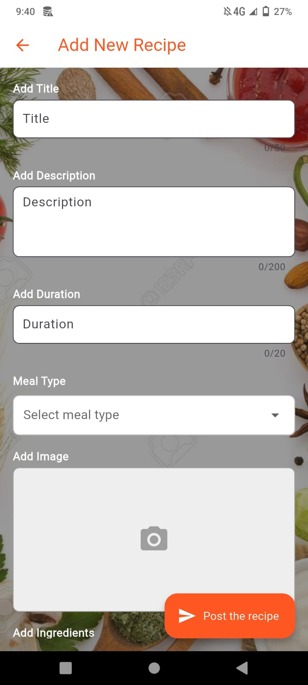<br/> <sub><b>Post a Recipe</b></sub> </td> <td align="center"> 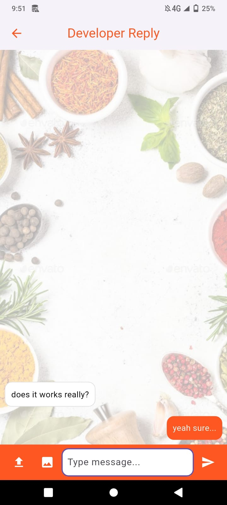<br/> <sub><b>Q&A Page</b></sub> </td> </tr> <tr> <td align="center"> 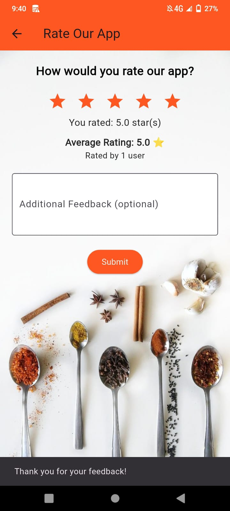<br/> <sub><b>Ratings Page</b></sub> </td> <td align="center"> 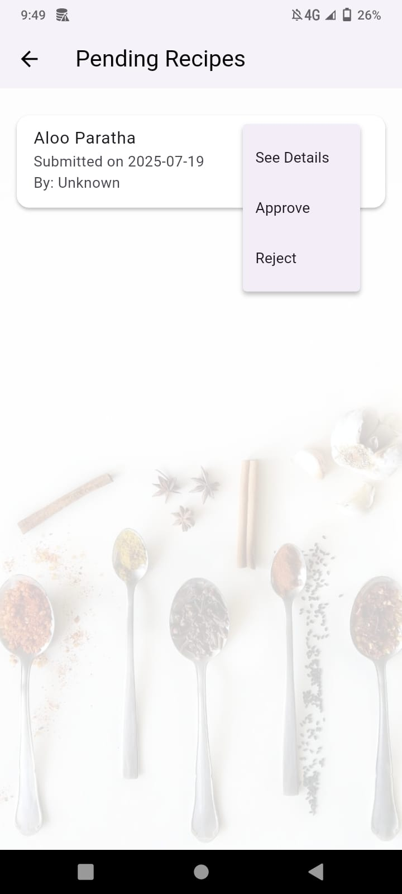<br/> <sub><b>Approve Pending Recipe</b></sub> </td> <td align="center"> 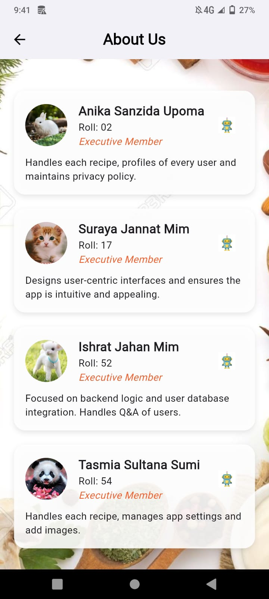<br/> <sub><b>About Us</b></sub> </td> </tr> <tr> <td align="center"> 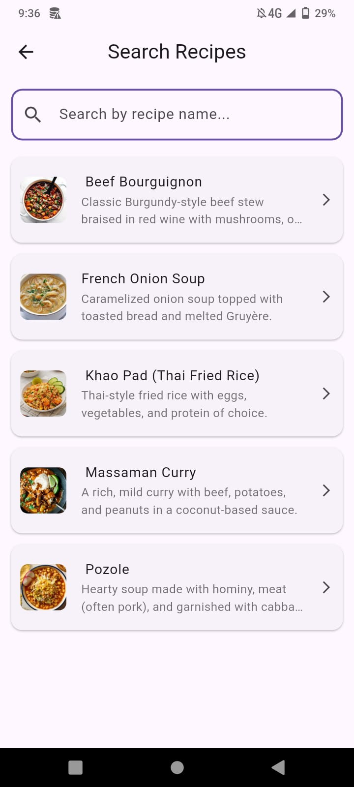<br/> <sub><b>Search in Home Page</b></sub> </td> <td align="center"> 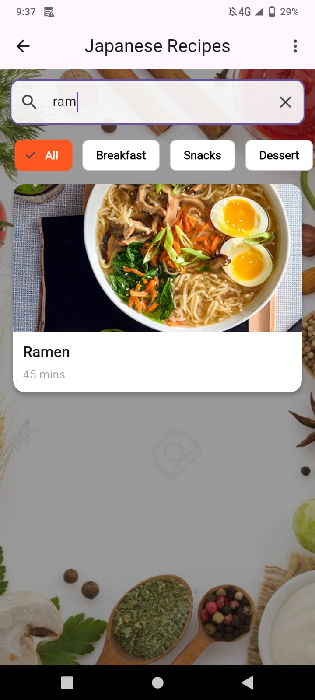<br/> <sub><b>Search in Recipe Page</b></sub> </td> <td align="center"> 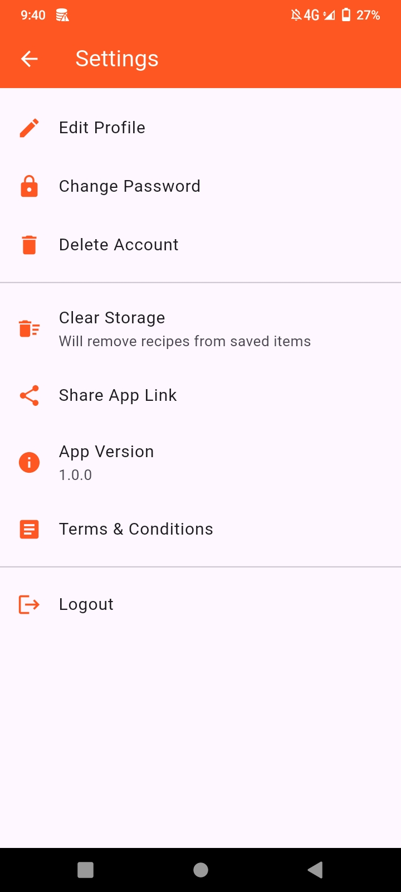<br/> <sub><b>Settings Page</b></sub> </td> </tr> </table>


---
## Team Name
### DU_CodeBots🤖

## Authors
- Anika Sanzida Upoma (Roll-02)
- Suraya Jannat Mim (Roll-17)
- Ishrat Jahan Mim (Roll-52)
- Tasmia Sultana Sumi (Roll-54)

